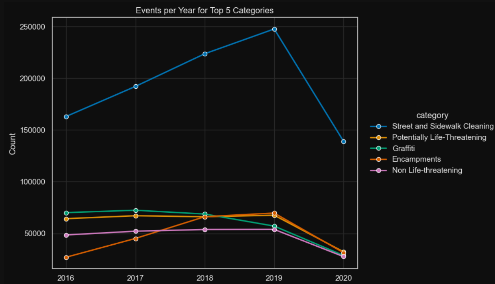
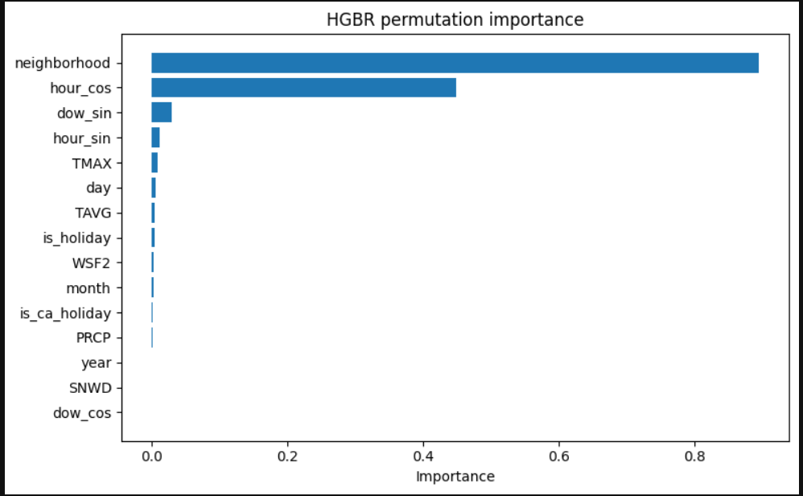
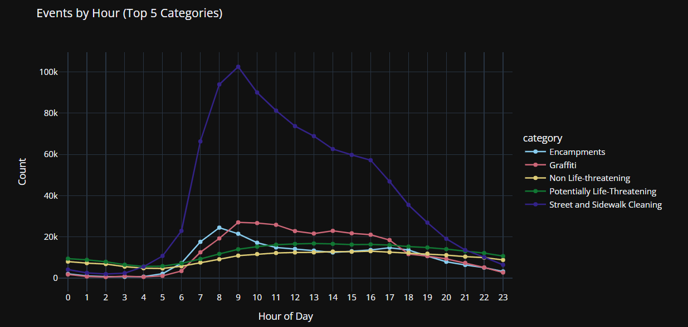
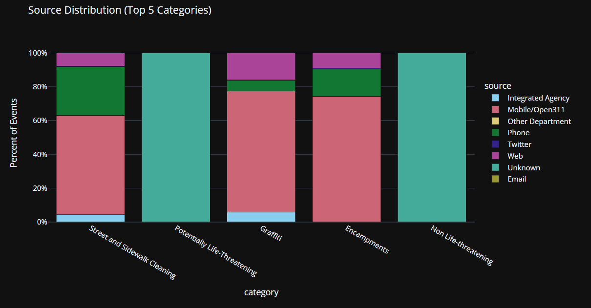
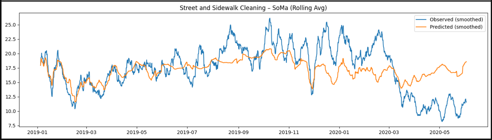
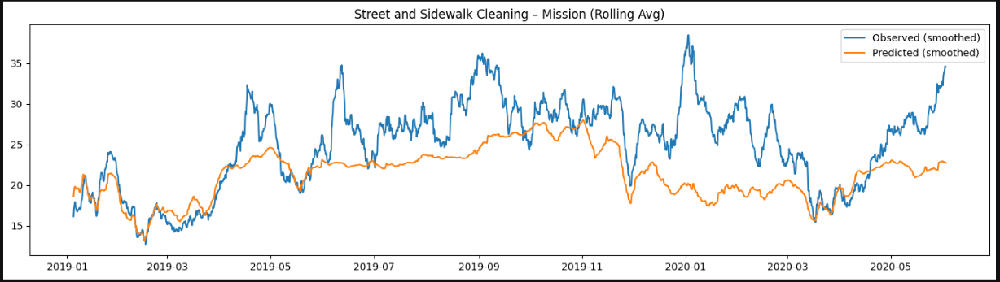

# SF_Civic_Service_Demand_Forecasting
Forecasting San Francisco 311 / 911 safety-related service demand at the neighborhood level using time-aware regression models.

---

- [Overview](#-overview)
- [Methodology](#-methodology)
- [Analytical Techniques and Tools](#-analytical-techniques-and-tools)
- [Feature Engineering](#-feature-engineering)
- [Modeling Approach](#-modeling-approach)
- [Results](#-results)
- [Project Setup](#-project-setup)
- [Repository Structure](#-repository-structure)

---

## Overview

City services routinely need to respond to safety events which range from disturbances, including noise, illegal parking, graffiti, and curb problems. This project will predict the number of different types of [311 events in San Francisco](https://www.sf.gov/departments--311-customer-service-center) per neighborhood and for a given date, based on historical data. Accurate models will help ensure that enough customer service agents and resources are available and able to respond promptly to these requests.

Our dataset is based on San Francisco 311 service call data ranging from 2016 to 2020. We develop and evaluate time-aware regression models to forecast aggregated San Francisco 311 safety-related service demand at the neighborhood level. These models assess whether historical call data, combined with temporal, weather, holiday, and operational schedule features, can produce reliable short-horizon demand forecasts suitable for planning and resource allocation. Forecasting is performed at a fixed 6-hour interval across selected neighborhoods and service categories.

---

## Methodology

* Analyze available events data to identify trends, impact of seasonality, and consistency of data.
* Build machine learning models to predict the number of events of a given type for a particular date and location.
* Use external datasets to improve model performance.
* Make predictions more explainable by using model interpretability tools.
* Prevent undesired biases or discrimination when models are put into production.
* Evaluate model performance during city-wide lockdowns during the COVID-19 pandemic.

---

## Analytical Techniques and Tools

* Cleaning, filtering and pre-processing the data loaded from Parquet files
    * [pandas](https://pandas.pydata.org/)
* Analysis and visualization of location-based and time-dependent data
    * [pandas](https://pandas.pydata.org/)
    * [matplotlib](https://matplotlib.org/)
* Machine Learning model training, evaluation, hyper-parameter tuning
    * [scikit-learn](https://pypi.org/project/scikit-learn/)
* Python package creation
    * [setuptools](https://pypi.org/project/setuptools/)
* Evaluating of bias risk and ethical considerations 
    * [deon](https://deon.drivendata.org/#data-science-ethics-checklist)

---

## Feature Engineering

We have several different service categories for 311 / 911 city event records:

* Street and Sidewalk Cleaning
* Potentially Life-Threatening
* Graffiti
* Encampments
* Non Life-threatening

For each service category we:
1.  Filter events by category
2. Aggregate counts by: 
    1. Neighborhood
    2. Six-hour interval
3. Construct a complete neighborhood × time grid
4. Fill missing time intervals with zero counts to ensure consistent time indexing and avoid missing data

#### Temporal Features

* Year, Month, Day
* Day of Week
* Hour of Day

#### External Signals

* Daily weather variables
    * NOAA station data
* Federal and California holiday indicators
* Street sweeping schedule intensity by neighborhood

## Modeling Approach
* Create a baseline model
    * DummyRegressor (mean)

* Generate anad assess several candidate models
    * Ridge Regression
    * Poisson Regressor
    * HistGradientBoostingRegressor

* Validation Strategy
    * Time-ordered train/test split
    * Forward-chaining cross-validation
    * Hyperparameter tuning using GridSearchCV / RandomizedSearchCV

## Evaluating Model Performance

Performance varies by service category and neighborhood.

Evaluation includes:

* RMSE
* Mean Absolute Error (MAE)
* Maximum Error
* Mean Residual (Directional Bias)
* Neighborhood-level residual time series

---
## Results

The models created in this project were evaluated using RMSE, MAE, and neighborhood-level residual analysis, predicting the count of events in 6-hour bins per neighborhood. A historical-mean baseline (DummyRegressor) was used as a benchmark. Data was split in a non-shuffling manner so that training explained the past and testing evaluates the future. Short-horizon municipal service demand can be forecasted with some accuracy when time patterns and external signals are incorporated. Gradient boosting models consistently outperformed linear and baseline approaches, indicating that service demand exhibits nonlinear relationships with time, weather, and added operational features.

### Observations:
* **Gradient boosting consistently outperformed baseline models.**

|model|split|RMSE|MAE|MaxError|R2|category|
|-----|-----|----|---|--------|--|--------|					
|DummyRegressor(mean)|test	|[315.66105918346204]	|12.717419	|114.320973|	-0.066264|	Street and Sidewalk Cleaning|
||test|[13.047501456216493]|2.766460|24.436969|-0.017965|Potentially Life-Threatening
||test|[34.91849546106956]|4.222823|57.569715|-0.044413|Graffiti
||test|[71.66740308735355]|5.854601|71.075331|-0.142300|Encampments
||test|[7.060386498486054]|2.092700|20.473729|-0.004974|Non Life-threatening
||train|[160.6292710592482]|10.008496|93.320973|0.000000|Street and Sidewalk Cleaning
||train|[10.064604220686489]|2.517876|19.436969|0.000000|Potentially Life-Threatening
||train|[77.9941433859194]|4.970890|241.569715|0.000000|Graffiti
||train|[31.883563047115835]|4.115343|48.075331|0.000000|Encampments
||train|[6.4704315329571225]|2.021285|26.473729|0.000000|Non Life-threatening
HistGradientBoostingRegressor|test|[69.56602151861375]|5.103549|63.317243|0.765015|Street and Sidewalk Cleaning
||test|[5.868166314869755]|1.794732|20.819180|0.542166|Potentially Life-Threatening
||test|[20.924633423839587]|2.559405|49.966701|0.374144|Graffiti
||test|[20.283266456716223]|2.675536|50.298835|0.676707|Encampments
||test|[3.8663632087421598]|1.498895|16.943422|0.449663|Non Life-threatening
||train|[27.01262485256201]|3.496032|89.576704|0.831832|Street and Sidewalk Cleaning
||train|[4.553993588211167]|1.659293|13.905226|0.547524|Potentially Life-Threatening
||train|[40.30572021782909]|3.163297|208.937523|0.483221|Graffiti
||train|[6.25695021727461]|1.549894|25.822132|0.803756|Encampments
||train|[3.498557470861499]|1.443707|21.506621|0.459301|Non Life-threatening?

The baseline model predicts the historical mean, producing high errors with negative or near-zero R² across categories. The tuned HGBR model substantially lowers RMSE and MAE on the test set and produces consistently positive R² values. For example, `Street and Sidewalk Cleaning` test RMSE drops from about **316** under the baseline to about **70** with HGBR, with R² improving from negative to **0.77**. Similar improvements appear across all categories, indicating that the gradient boosting model captures meaningful temporal and contextual structure that the baseline cannot.

* **Service demand generally followed predictable temporal cycles**, particularly by hour of day and day of week. Service calls had their highest volume, regardless of category, around 9:00 AM and on Monday, following traditional business hours.

* **Mobile/Open311 was the predominant source of events**, with Phone or Web events being distant second or third in volume. Events such as COVID-19 and its associated lockdowns mean the city loses significant amounts of crowdsourced monitoring capacity. At the same time, lessened monitoring does not mean that the underlying facts on the ground reduced or increased in volume. 
 

The "Uknown" nature of `Potentially Life-Threatening` and `Non Life-Threatening` points to systemic encoding issue; events of this nature imply threat to human life and limb, while the other categories seems based on non-urgent events.

* **Forecast accuracy varies by neighborhood**, highlighting the need for neighborhood-level, localized, model evaluations instead of generalization based on city-wide metrics. The heterogenous nature of our model predictions within different event categoires imply features unexplored, such as employment type, foot and vehicle traffic patterns, and property types, all of which could impact the volume and classification of reporting.
* **Applied to 2020 data, models trained on earlier years exhibited concept drift.** After COVID-19 lockdown events, predicted and observed counts for city events diverged in interesting ways. For example, in the `SoMA` district the predicted number of `Street and Sidewalk Cleaning` events steadily rose, while the actual number observed dropped significantly and flattened. Lockdown events combined with work-from-home company policies may have reduced the number of people available to observe and report city events for category.

This behavior contrasts with the `Mission` district, where the actual number of events reported exceeds model-predicted amounts. Lockdown directives altered working and living patterns, which may unintentionally have enabled heightened monitoring in this district due to increased food vendor traffic, due to workplace cafeterias being unavailable, and larger amounts of delivery drivers in this area.

